# My Memory and Me
The objective of this website is to provide an informative website for those who are worried they may be suffering from dementia or for individuals who suspect a family member/friend is suffering from dementia. 
The website provides a brief insight into what dementia is, what can cause dementia, how dementia is diagnosed and possible dementia treatments available. The main function of the site is designed towards 
individuals worried they might have dementia and be struggling with short memory issues. The site has 2 games designed to test memory and an algorithm that gives you a feedback on your short-term memory
based on these games. Hence, the main aim of this site is:

- To inform others about dementia
- To help with early diagnosis of dementia using memory games
- To provide information of the available support for dementia sufferer

The site is intended to have a simple easy to navigate design as the target audience will be the older members of the population as they are much more likely to suffer from dementia.

A live demo of the site can be found [here](https://johngc1510.github.io/milestone-project-2/)

### **Business Goals**
- To accurately inform others about dementia 
- To have a platform which can help spot early signs of dementia
- To improve peoples awareness of the different types of support available to those suffering from dementia

### **Customer Goals**
- To obtain information about dementia
- To test their short term memory 
- To find local support options if currently suffering from dementia

## Table of Contents
1. [User Design](#ux)
2. [WireFrames](#wireframes)
3. [Features](#features)
4. [Technologies](#technologies-used)
5. [Testing](#testing)
6. [Deployment](#deployment)
7. [Credits](#credits)
## UX
---
### **Ideal User**
- Anyone who is worried they may be suffering from dementia
- Anyone suffering from dementia
- Anyone who has a loved one/friend they are worried are showing sings of dementia  

### **User Stories**
1. As a new visitor I want the purpose of the website to be immediately clear
2. As a new visitor I want information on dementia
3. As a new visitor I want to be able to test my memory
4. As a new visitor I want to know support available to me
5. As a new visitor I want to be able to enjoy the games
6. As a new visitor I want the games to be easy to play
7. As a new visitor I want to easily navigate the site
8. As a new visitor I want the results of my test to be clear and obvious.

### **Design Choices**

#### **Font**
 I used Montserrat for the headings and Roboto for the body as I beleive this looked professional and was clear and easy to read.

#### **Icons**
I used Font Awesome icons for my social media links as it gives a intuitive way for users to access the sites social media. I also used Font Awesome icons to make my drop down and mute buttons 
more intuitive to users. 

#### **Colors**
The color scheme was light grey - blue. This is based on the blue color of the logo which has a strong association with the alzheimers society. I wanted everything to be clear and easy to read so I kept 
the colour scheme simple. Choosing grey and blue as the colours complement each other well. 

#### **Hero Image**
I wanted the hero image to fit the theme of the site and believe it does lead you to think about mind/memory when you view it. Over the hero image is text and a call to action button to take the memory tests which
is the sites primary focus. 

#### **About Dementia section**
I wanted the site to be informative as well as providing a simple way to test your memory. I used drop down boxes to contain the information as it keeps the site looking neat and does not overwhelm with the volume of text.
There is a lot of information available within the drop-down boxes and by having it contained within the boxes I beleive it to be more user friendly and less intimidating than scrolling down and seeing 6 large blocks of text.

#### **Memory Tests Page**
I wanted the design of this page to be simple, giving easy access to both games and to your combined results. I wanted each games header and image to represent the game so the user would already have an idea how to play 
before navigating to the games page and reading the instructions.

#### **Game One**
I wanted the design of the game to be simple with clear instructions. I wanted it to be intutive to play with clear buttons to start, reset the board and mute the music if you wish. 

#### **Game Two**
I wanted game 2 to have a clear and obvious flash when the game was playing to make the game easy to play. I also wanted the cicrcles to have basic 3d effects to look more like buttons you would press to increase intuitivety.  

#### **Support Page**
The support page designed to not overwhelm the users with information and allow them to access it at their own page. Alongisde the information boxes is a map which shows locations where the different types of support could be found
in the major cities in the UK.

### **Wireframes**
#### Index Wireframe

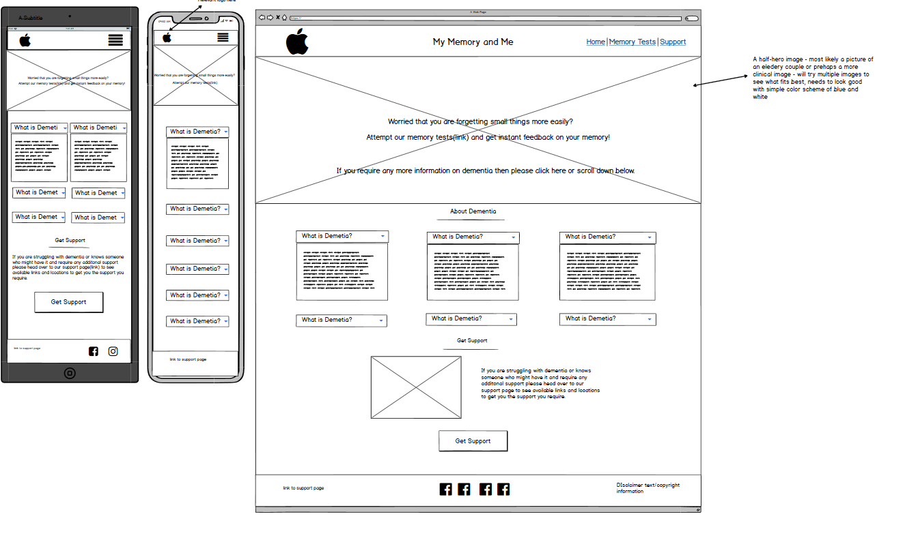

#### Memory Games Wireframe

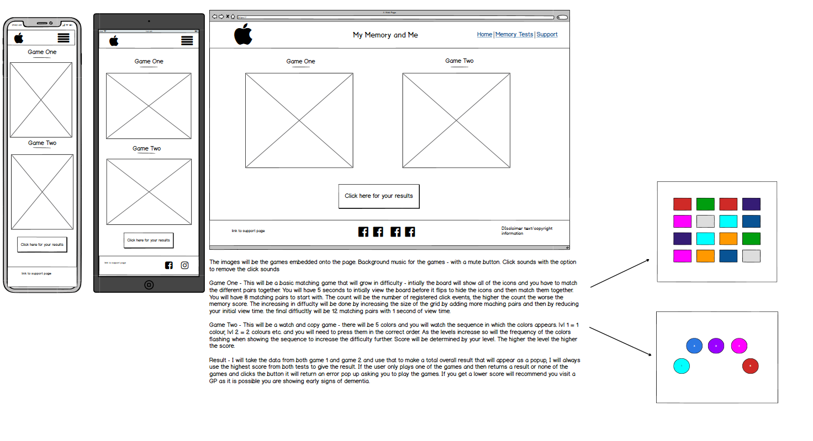

#### Support Wireframe

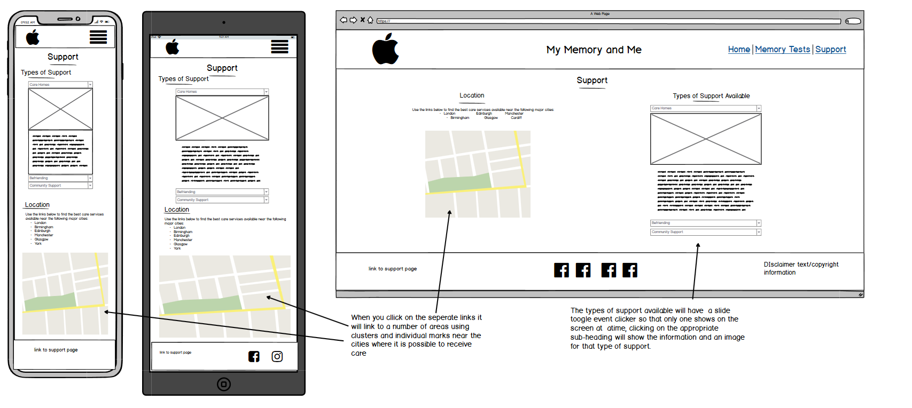

## Features
---
### **Existing Feautres**
- The website is responsive on all device sizes.
#### Game One and Two
- Both game 1 and 2 are fully functional and allow you to mute sound if wanted. Game 1 allows you to reset the game mid-game and both games will
give feedback upon completion.  
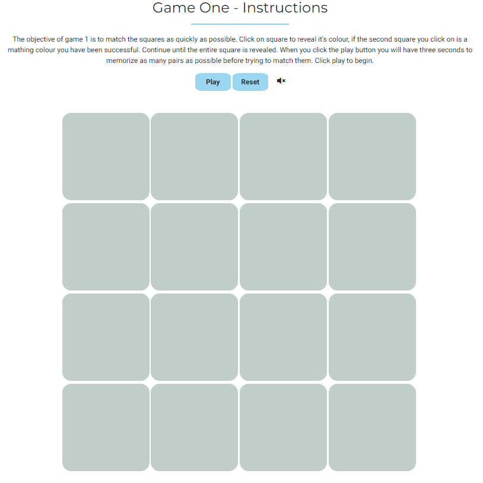
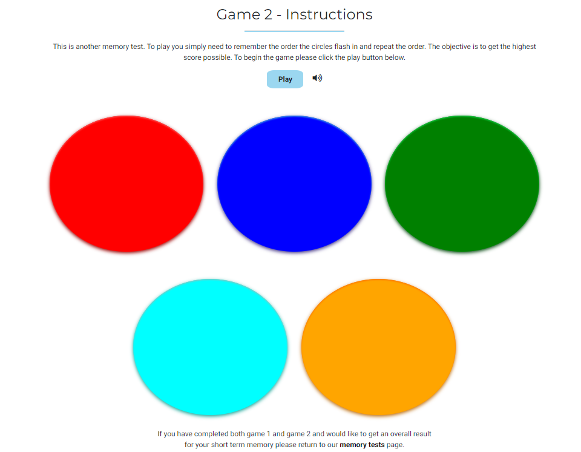
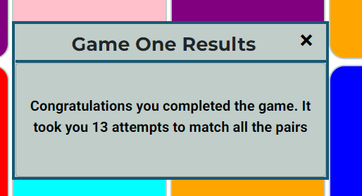
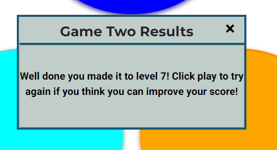
- Fixed navigation bar on mobile for easy navigation.
- Results button on my-memory gives feedback for both game 1 and game 2. 
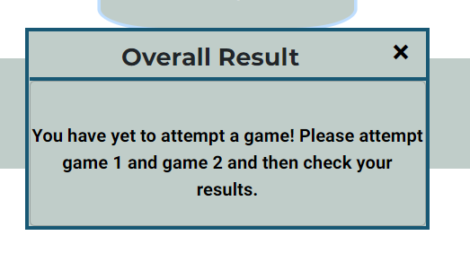
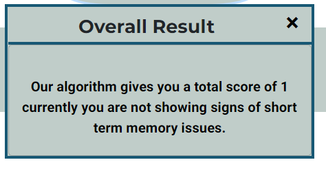
- Google Map has clusters to avoid clutter and unique infowindows for each map. 
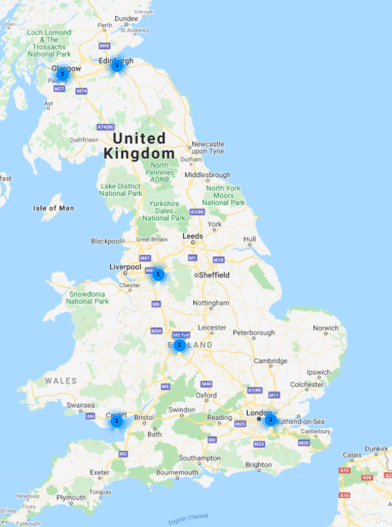
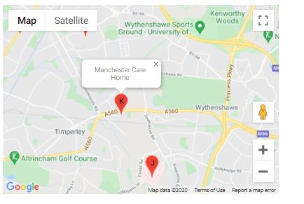
- On index and support page JS has been used to show and hide content for a cleaner look. 
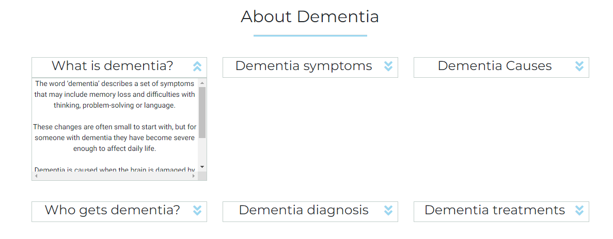

### **Differences from wireframes**
- I initially wanted to have both games embedded on the memory games page but on desktop it meant the games had to be too small and could have lead to issues with users clicking between games so made both the games on 
a seperate page and just linked to them from the memory games page.
- I swapped the map and the support information on the support page as it is more intuitive to have information about support followed by locations that you can receive support. 
- I added additonal navigation underneath the games to make it easier to move between games and the memory page. 
### **Features left to implement**
- To add better 3-d effects to my buttons in game 2 and add a flattening animation when you click on the button to give a feeling of actually pressing a button. 
- Add functionality for users to create a account on the site and then keep track of their scores over weeks to give a indication if memory is improving with regular practice. 

## Technologies Used
---
This project used the languages HTML5, javascript and CSS3.

- [jQuery](https://jquery.com/) - The jQuery library was used on all pages.
- [GitPod](https://gitpod.io/workspaces/) - The entire website was developed in GitPod
- [GitHub](https://github.com/) - GitHub was used to store the project and to deploy it using the master branch on the github site
- [Bootstrap](https://getbootstrap.com/) - The grid structure was used to structure the website and make it responsive and some default items in bootstrap were used as a starting point
- [FontAwesome](https://fontawesome.com/) - Font Awesome was used for the social media icons

## Testing
---
### **Code Validation**
- All pages have been put through the [HTML validator](https://validator.w3.org/) and the [CSS validator](https://jigsaw.w3.org/css-validator/) to ensure no syntax errors. 
- With CSS validator discovered missing } causing an error.
- Using HTML5 validator on index.html I had nested a button inside an anchor - I fixed this issue by removing the button and styling the anchor as a button.
### **User Story Testing**
1. As a new visitor I want the purpose of the website to be immediately clear
    - Acheived - clear title and hero image with a call to action button that describes the funcition of the site
2. As a new vistor I want to information on dementia
    - Acheived - information very easy to access and clearly layed out on index page 
3. As a new visitor I want to be able to test my memory:
    - Acheived - Call to action button provides link to tests and on completion of both tests you can get an overall result
4. As a new vistor I want to know support available to me
    - Acheived - every page prompts you to visit the support page if you feel in need of seeing options for addiotnal support.
5. As a new visitor I want to be able to enjoy the games
    - Partially Achieved - the games run smoothly and game 1 has relaxing background music whilst playing and game 2 has colours alongside it's animations.
        To imporve this I could imporve the visual apperance and animations in both game 1 and game 2. Adding a flip animation in game 1 and adding 3d effects
        to the buttons would make clicking a button in both games more satisfying. 
6. As a new visitor I want the games to be easy to play:
    - Acheieved - The games are intuitive and suitable for the target audience
7. As a new visitor I want to easily navigate the site:
    - Acheived - fixed nav bar on mobiles and clear navigation throughout. Additonal prompts at the bottom of the game pages with links to either game or to go back and see your results.
8. As a new visitor I want the results of my test to be clear and obvious.
    - Partially Acheived - the reuslts button is obvious however the algorithm that calculates reuslts just gives a number, above zero being a resonable score and below zero performing 
    poorly. I could try and convert my algorithm to give a grade or convert the score to something out of 10 to give a more familiar score rather than a meaningless number. The text tells
    with the alert clearly tells you how you have performed.

### **Manual Testing**   
- I extensivley tested the layout across multiple devices: On a 4k monitor, a HD monitor, 15.4inch laptop, an Ipad, a Huwawei P30 Pro, Google Pixel 3, Google Pixel 3XL and on a chromebook. 
- I tested the site on multiple browser including Chrome, Microsoft Edge and Firefox.
#### **Game One**
I tested game one in a large number of ways to attempt to break it:
- I first could complete the game by clicking on the same tile twice which gave a successful outcome so the entire game could be completed without matching tiles. This was fixed by adding 
     if(this === firstClick) return; when the firstClick was defined and secondClick had yet to be defined. 
- You could initally click the cards before the baord had flipped to neutral to get a head-start. Using the clickable booelan and only setting this true to when the board flipped prevented users 
    from clicking when they could see the colours.
- The game could be broken by exceptionally fast clicking between cards, I fixed this issue by adding a time delay to when you can click again after the two cards have been clicked using the setTimeout method.  
My inital attempt to add a reset button to the board by recalling the addBoardColors() function broke the game in multiple ways:
1. If you had succesfully paired cards in the previous game they were unclickable in the next game.
2. When the function was called the board had 3 or 4 cards of the same colors and could be entirely missing 1 color.
3. I did not orgininally reset the winning score counter so the game could be completed without fully matching the reset board.
 
 - Problem 1 was solved by ensuring that I reset the card array at the start of the fucntion as some would have been removed upon successful pairing.
 - Problem 2 was caused as the cards still had a data-color and a color class from the first call of addBoardColors(), so some cards had multiple color classes
   which were being called in order preference whilst cards that had been successfully paired had a single color class that could have been a color in the previous game, 
   allowing for a maximum fo 4 cards of the same color. I sovled this by adding a function to clear data-color and clear the cards color class when resetting so calling
   addBoardColors() happened to cards with empty data attributes and color classes. 
 - Problem 3 was easily solved by resetting the variable matched-pairs = 0;
 #### **Game Two**
 In my intial attempts at the game I tried to make everything dynamic, I randomly generated a single color which the computer then highlighted and stored that value in array. The user would then 
 be able to click on the highlighted button. I then tried to create a function that highlighted old colors before highlighting a new random color and adding this to the array which the user had to 
 match. The issue I had with this was I did not run the funciton using a set interval, I attempted to use multiple timeout functions which ended up colours flashing inconsistently and often during 
 a users turn. Setting and clearing an interval when the computer turn was done solved this issue. I also generated the full order that the computer would highlight the buttons before the game 
 started playing, dynamically updating used while(hightlight < level){gameTurn} which can result in a infnite loop if the user never fails or the program is played by a bot.   
 When initially adding sound to game Two I used a function that created a audio file dynamically each time I wanted to play the sound. See image below.  
 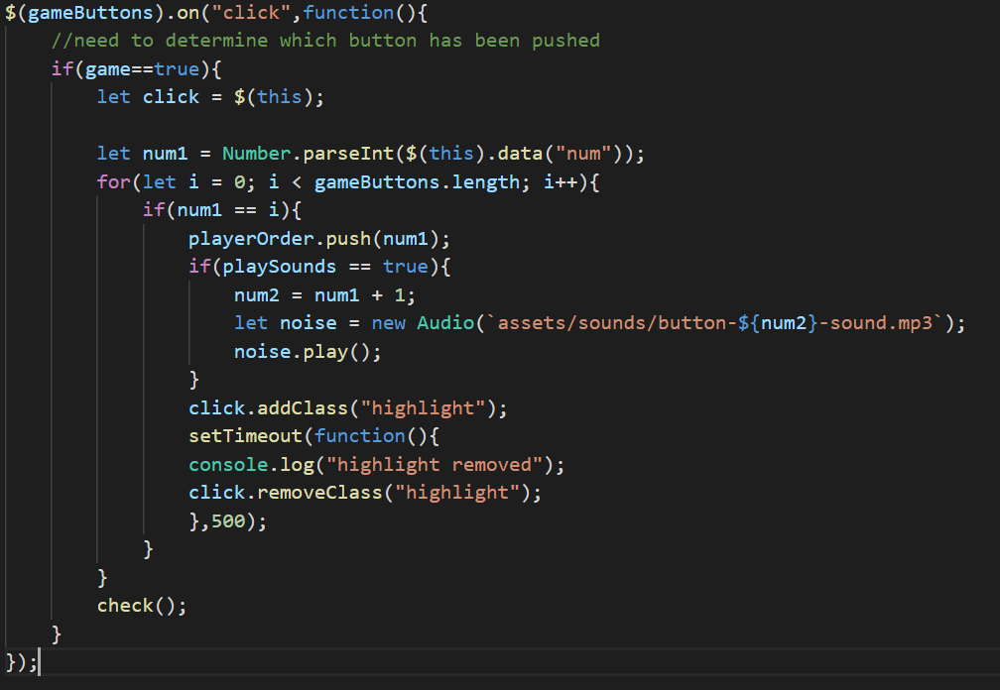 
 This dynamic audio caused a lag between the highlight animation and the sound, this was fixed by preloading the sounds storing them in an array and choosing the appropriate sound from an array.  
 There was initially a bug where, if you lost the game, the alert would display and when you closed the alert the final color from your previous game would flash. This could easily cause confusion as
 the user would see two highlights for the first level, the first happening very quickly from the previous game. I intially solved this by adding a timeout when you lose of 300ms to allow the 200ms 
 flash to occur however I improved on this when adding a play button so the game would not restart upon a loss; only when hitting the play button.   
 I found a bug in game 2 where if you clicked the play button again in the middle of a computer turn then it caused the game to bug out and the game would move to level 1 with multiple circles higlighting. To prevent 
 users doing this I removed the click event from the play button during the middle of the game, the click event is restored upon loss allowing players to restart the game. This is not an ideal solution as players can 
 no longer restart the game half way through it however I was unable to find the underlying cause of this bug. To try and make this solution clearer to the users I ensured that the play button remains grey looking '
 not clickable' whilst the game is in porgress.

## Deployment
---
During development I used a remote server to locally deploy the site to observe changes uisng the command python3 -m http.server in the gitpod console. 
The site is hosted usig GitHub and has been deployed directly from the master branch. The master branch was the only branch used for this website. I deployed the site by:
1. On GitHuB navigating to my repositroy, JohnGC1510/milestone-project-2
2. Whilst inside this repositroy click on the settings tab (which is the far right tab)
3. Scroll down until you come to the "source" drop-down menu and select master branch as the publishing source - this provided me with a link to the deployed version.

## Credits
---
### **Code**
- [Bootstrap 4](https://getbootstrap.com/): Bootstrap library used throughout main project - used the cards template, the grid system, modals and the default slider with custom css.
- Used the UDX resume lesson from Code Institue to assist with embedding the google map using the maps API.
- [jQuery](https://jquery.com/) - Used jQuery library to assist with javascript.
- [Simon Game Tutorial](https://www.youtube.com/watch?v=n_ec3eowFLQ&t=2185s&ab_channel=freeCodeCamp.org) - This tutorial gave me the idea to use a boolean to seperate the comupter turns from the user turns as well as assigning the interval to
a variable to allow me to clear it to stop the computer turn from continuing. 
- [Memory Game Tutorial](https://www.youtube.com/watch?v=bbb9dZotsOc&t=1266s&ab_channel=WebDevJunkie) - I was struggling to randomize by board without having colors appear more than twice or having a card targeted more than once, splicing the 
card out of the card array to stop it being targeted twice was taken from this tutorial.
- [Map Info Box Solution](https://leewc.com/articles/google-maps-infowindow/) - When creating the info boxes for my google maps I was only able to make a single infobox shown from the final item in my array. I found the solution to this issue here. 

### **Media**
- Images taken from appropriate google image searches - I own no right to any images used.

### **Infomration**
- All information on dementia was taken from the [Alzheimers Scoiety](https://www.alzheimers.org.uk/about-dementia/types-dementia/what-dementia).

### **Acknowledgements**
- My mentor Anthony Montaro for his fantastic support and assistance.
- The slack community for their continued support, in particular JimLynx for his helpful troubleshooting my design. 